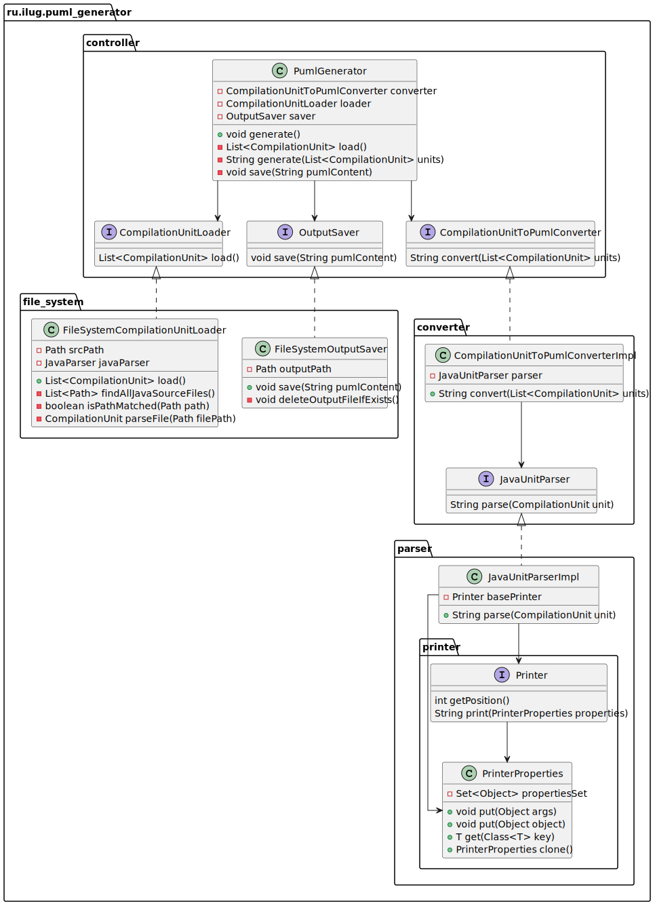

# PlantUML Generator

Generates a **PlantUML** class dependency configuration based on the **Java source code**.

Example:


# Usage

It is enough to **execute the jar** file inside the project's working directory:

```shell
java -jar puml-generator.jar
```

By default, the **sources are searched** in the directory `./src/main/java/`, and the **output file** will be saved as
`./main.puml`.

```shell
java -jar puml-generator.jar -config /path/to/config.json
```

## Configuration

Default configuration:

| Parameter        | Default value      | Description                                                                                                                                                                          |
|------------------|--------------------|--------------------------------------------------------------------------------------------------------------------------------------------------------------------------------------|
| srcPath          | `./src/main/java/` | Path to java sources                                                                                                                                                                 |
| outputFile       | `./main.puml`      | Output file                                                                                                                                                                          |
| dependencies     | `empty list`       | A list of jar file paths that are dependencies in the source code being processed. Dependencies are optional and are only required if you want to see them on your dependency graph. |
| packages         | `object`           | The rules that define the packages that should be showed                                                                                                                             |
| interfaces       | `true`             | Show interfaces                                                                                                                                                                      |
| abstractClasses  | `true`             | Show abstract classes                                                                                                                                                                |
| subClasses       | `true`             | Show subclasses                                                                                                                                                                      |
| generics         | `true`             | Show class generics                                                                                                                                                                  |
| fields           | `true`             | Show class fields                                                                                                                                                                    |
| fieldVisibility  | `true`             | Show class fields visibility modifiers                                                                                                                                               |
| fieldType        | `true`             | Show class fields types                                                                                                                                                              |
| fieldName        | `true`             | Show class fields names                                                                                                                                                              |
| publicFields     | `true`             | Show public class fields                                                                                                                                                             |
| privateFields    | `true`             | Show private class fields                                                                                                                                                            |
| protectedFields  | `true`             | Show protected class fields                                                                                                                                                          |
| staticFields     | `true`             | Show static class fields                                                                                                                                                             |
| methods          | `true`             | Show methods                                                                                                                                                                         |
| methodVisibility | `true`             | Show methods visibility modifiers                                                                                                                                                    |
| methodType       | `true`             | Show methods types                                                                                                                                                                   |
| methodName       | `true`             | Show methods names                                                                                                                                                                   |
| methodArgs       | `true`             | Show methods arguments                                                                                                                                                               |
| methodArgsType   | `true`             | Show methods arguments types                                                                                                                                                         |
| methodArgsName   | `true`             | Show methods arguments names                                                                                                                                                         |
| publicMethods    | `true`             | Show public methods                                                                                                                                                                  |
| privateMethods   | `true`             | Show private methods                                                                                                                                                                 |
| protectedMethods | `true`             | Show protected methods                                                                                                                                                               |
| staticMethods    | `true`             | Show static methods                                                                                                                                                                  |
| abstractMethods  | `true`             | Show abstract methods                                                                                                                                                                |

Packages:

| Parameter | Default value | Description       |
|-----------|---------------|-------------------|
| include   | `empty list`  | Included packages |
| exclude   | `empty list`  | Excluded packages |
